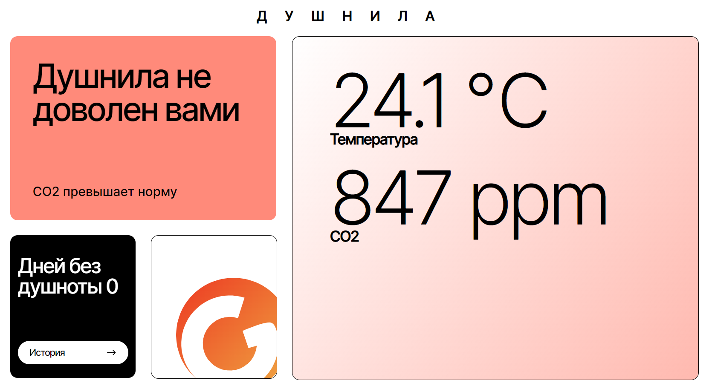

# Dushnila Page

>*В ветке 'master' находится код проекта, выполненный по макету для разрешения экрана от 1920х1020 px, в ветке 'dev' - код с использованием адаптивности для разрешения экрана ниже 1920х1020 px, который отличается от макета.*
## Структура проекта:
- **store.js** - файл, который создает глобальное хранилище Redux, которое хранит и управляет состоянием приложения, включая показатели CO2, температуры и статуса.
- **actions.js** - файл,который используется для создания и возвращения объектов экшенов, которые обновляют соответствующий параметр в глобальном хранилище Redux: **updateCO2** для обновления значения CO2, updateTemp для обновления значения температуры, и **updateStatus** для обновления значения статуса.
- **Card.jsx** - компонент, который предназначен для отображения информации о количестве дней без душности и кнопки для просмотра истории.
- **Result.jsx** - компонент, который предназначен для отображения результата на основе данных о уровне CO2, температуре и статусе душности, полученных из глобального состояния (**Redux store**).
- **Temperature.jsx** - компонент, который предназначен для отображения текущих показателей температуры и уровня CO2. Он также обновляет эти показатели с сервера каждую минуту и сохраняет их в глобальное состояние Redux, а также обновляет статус душности в зависимости от этих показателей.

## Главные особенности проекта:
1. Используется хук **'useSelector'** из библиотеки 'react-redux' для получения данных из хранилища состояния **Redux**.
2. Используется хук **'useDispatch'** из библиотеки 'react-redux' для отправки действий Redux.
3. Значения значения 'co2', 'temp' и 'status' определяются из хранилища состояния Redux.
4. Используется эффект **'useEffect'** для вызова функции **'get_indicators()'** при монтировании компонента и каждые 60 секунд.
## Инструкции по запуску проекта:
- git clone <ссылка_на_репозиторий>
- cd <папка_проекта>
- npm install
 -npm start